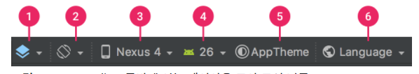

## Android Id

- @+id
    - 해당 앱 내(자신의 apk내에서)새로운 resource Id를 생성함
- @android:id
    - 앱이 아닌 안드로이드 프레임워크에 있는 resource 에 접근함

## Constraint Layout - bias

- 일반적으로 anchor 를 양쪽으로 하면 중앙 정렬 된다.
- bias 를 설정하여 한쪽으로 치우치게 위치 시킬 수 있다.

## Layout Editor

### 미리보기 모양 변경

- 기기 유형별로 디자인을 미리 볼 수 있음
- 앱 테마별로 디자인을 미리 볼 수 있음
- ...


https://developer.android.com/studio/write/layout-editor?hl=ko

# 옵저버 패턴 및 리스너

- 인터페이스(리스너)를 연결다리로하여 발신객체의 이벤트를 수신객체에게 전달하는 것
- 발신 객체가 인자로 받거나 들고 있는 인터페이스 객체의 구현을 수신자에서 함으로 써 가능함

### 1. 둘사이를 이어줄 인터페이스(이하 리스너)

```
interface EventListener {
    fun onEvent(count: Int)
}
```

### 2. 발신자 객체

    - 발신자는 인자로서 리스너를 받는다.
    - 특정 이벤트 발생시 리스너의 함수를 실행한다.

### 3. 수신자 객체

- 리스너를 상속받아 리스너의 함수를 구현한다.

```

class EventPrinter : EventListener {
    override fun onEvent(count: Int) {
        print("${count}-")
    }
}
```

### 동작 과정

1. 발신자 객체에서 이벤트가 발생하면 생성시 인자로 넣은 인터페이스 함수를 실행한다.
2. 컴파일시 연결된 인터페이스 함수의 구현체로 이동하여(수신자) 원하는 동작을 실행하다.

## 안드로이드 button 클릭 분석

```
testButton.setOnClickListener(object: View.OnClickListener {
    override fun onClick(v: View?) {
        Toast.makeText(this, "버튼이 클릭되었습니다.", Toast.LENGTH_SHORT).show()
    }
})
```
- button 은 View 클래스를 상송받고 View는 setOnClickListener 함수를 갖는다.
- setOnClickListener 는 OnClickListener 인터페이스를 인자로 받고 OnClickListener 객체를 들고 있는다.
- button(View)가 클릭이 되면 안드로이드 내부적으로 performClick() 함수가 실행된다.  
- performClick() 함수 는 내부적으로 OnClickListener 객체의 onClick 함수를 실행한다.
- 인터페이스 함수 onClick 을 구현한 내요을 실행하게 된다.


```
 public void setOnClickListener(@Nullable OnClickListener l) {
        if (!isClickable()) {
            setClickable(true);
        }
        getListenerInfo().mOnClickListener = l;
    }
```

```
public boolean performClick() {
    ...
    final ListenerInfo li = mListenerInfo;
    if (li != null && li.mOnClickListener != null) {
        li.mOnClickListener.onClick(this);
        ...
    } else {
        ...
    }
    ...
}
```

## 리사이클러 뷰 적용

상황 : 리사이클러 뷰에 아이템이 선택 되면 액티비티에 특정 동작을 수행하게 한다.

- 어뎁터가 발신자
- 엑티비티 수신자

1. 리스너 인터페이스 생성 (어디 구현해도 ㄱㅊ) 
2. 엑티비티에서 어뎁터에 인자로 리스너객체 넘기고
3. 어뎁터 클릭시 인터페이스 함수실행
4. 엑티비티에서 리스너 객체 구현