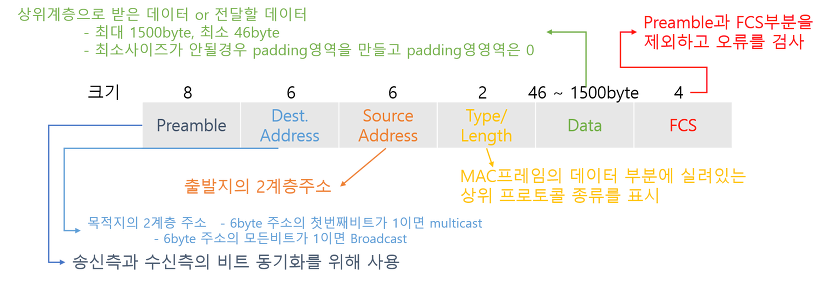

# chapter5.하드웨어와 네트워크 인터페이스 계층

## 네트워크 구성
- 레이어2 스위치(스위치 허브)로 하나의 네트워크를 구성
- 라우터 또는 레이어3스위치로 각 네트워크를 서로 연결하는 형태
- 네트워크 내에서 데이터를 전송하는 프로토콜로 이더넷과 무선 LAN(Wi-Fi) 등이 있음

## MAC 어드레스
- 네트워크 어댑터(랜카드, 이더넷카드..)어드레스라고하는 고유 기별번호
- 이더넷으로 데이터 전송시 패킷에 목적지에 MAC 어드레스 정보 포함
- MAC 어드레스는 전송 과정중에 통신 경로상에 다음 장비의 어드레스로 교체된다.
  - IP는 전송 과정중 고정된다.
  - MAC 어드레스가 가리키는 곳은 다음라우터이다.(MAC 어드레스는 최종 목적지가 아닌 다음 목적지를 가리킴)

## 이더넷
- 유선 LAN은 통신 장비끼리 케이블로 연결하게 되는데 이때 이더넷 규격을 사용하게 됨
- 0,1 을 전압의 높낮이로 표현하여 전달하게 됨
- 유선 인터넷에 대해서는 대부분 이더넷을 쓰는 환경이고 볼 수 있음
- 아래와 같은 헤더를 가지 프리앰블 패턴을두어  신호의 시작을 알수 있게 한다.

# 하드웨어 정리
## 허브 
- 전기적 신호를 증폭시켜 LAN 의 선송거리를 연장시킴
- 여러대의 디바이스를 연결해줌

## 스위치(L2 스위치허브, 허브)
- 자신에게 연결된 디바이스들의 MAC 주소 테이블을 가지고 있음

## 공유기
- ISP 가 제공하는 한개의 IP 어드레스로 여러 기기 들이 인터넷을 공유할 수 있도록함
- 공유기는 허브기능을 포함하여 여러대의 PC 를 연결할 수 있음
- 공유기에 여러기기 연결시 모두 인터넷이 되지만 허브는 1대밖에 안됨

https://blog.naver.com/PostView.naver?blogId=bizblocklll&logNo=222152306690&redirect=Dlog&widgetTypeCall=true&directAccess=false

