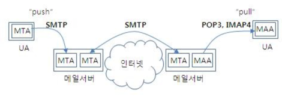

# Ch2. 네트워크 서비스와 어플리케이션 계층

## 어플리케이션 프로토콜

### 사용자가 직접적으로 사용하는 프로토콜

- HTTP : 웹 클라이언트와 웹 서버 사이에서 웹 페이지 데이터를 주고 받는다.
- POP,SMTP,IMAP : 메일을 송수신하고 보관한다.
- SMB, AFP : LAN 안에서 파일을 공유한다.
- FTP : 서버를 통해 파일을 주고 받는다.
- Telnet, SSH : 원격에서 서버를 제어한다.

### 사용자가 간접적으로 사용하는 프로토콜

- DNS : 도메인명과 IP 어드레스의 정보를 변환할 때 사용한다.
- DHCP : LAN 내의 컴퓨터에게 IP 어드레스를 할당할 때 사용한다.
- SSL/TLS : 통신 데이터를 암호화하여 주요 정보를 안전하게 주고 받을 때 사용한다.

##📌 HTTP 프로토콜

- 요청과 응답 두가지형태로 구분한다.
- 통신과정에서 주고받는 정보를 종합하여 HTTP 메세지라고 한다.
- HTTP 메세지
    - 요청 정보행(시작줄) : 메서드 + URL + 버전
    - 응답 정보행(시작줄) : 버전 + 상태코드 + 사유구절
      

### 📍HTTP 메세지 헤더
#### HTTP 공통 주요 헤더
- 요청 및 응답 메세지 모두에서 사용가능한 일반 목적의 헤더
- Date : 메세지 생성일시
- Connection : 클라이어트와 서버 간 연결에 대한 옵션설정 (close / Keep-Alive)

#### HTTP 엔티티 주요 헤더
- HTTP 헤더 내 엔티티(body) 관련 헤더
- ```Content-Type``` : 해당 객체에 포함되는 미디어 타입 정보
  - 컨텐츠 타입(MIME 미디어 타입) 및 문자 인코딩 방식 (UTF-8,EUC-KR) 을 지정
  - Ex1) Content-Type: text/html; charset-latin-1
    - 해당 객체가 html 텍스트 문서이고 , iso-latin-1 문자 인코딩 방식으로 표현됨을 말함
  - Ex2) Content-Type: application/json
- Content-Encoding : 해당 객체 데이터 압축 방식
- Content-Length : 객체의 바이트 길이 또는 크기

#### HTTP 요청 주요 헤더
- HTTP 헤더 내 요청 헤더에만 포함되는 항목
- Host : 요청하는 소스트에 대한 호스트명 몇 포트번호 (필수)
  - 포트번호를 통한 부닉로 단일 서버에 여러 사이트를 구축할 수 있다.
- ```Cookie``` : 서버에 의해 Set-Cookie로 클라이언트에게 설정된 쿠키 정보
- Authorization : 인증토큰(JWT)를 서버로 보낼 때 사용하는 헤더
#### HTTP 응답 주요 헤더
- Server : 서버 소프트웨어 정보
- ```Set-Cookie``` : 서버측에서 클라이언트에게 세션 쿠키정보를 설정

### 📍AJAX

- HTTP 메세지로 통신함
- 요청 주체가 브라우저가 아닌 JS로 작성된 프로그램

1. 자바스크립트를 통해 XMLHttpRequest 객체를 만들어 서버로 요청을 보낸다.
2. 요청을 보낸 상태에서 서버의 응답을 기다릴 필요없이 다른 작업 처리 가능 -> 비동기
3. 서버에서의 응답을 받고 JS는 일부분만을 갱신하게 한다.
   

### 웹 서비스(웹 어플리케이션) vs 웹 사이트

#### 웹 사이트란?

- 정보 관람을 목적으로 한 정보를 제공하는 ```정적인``` 사이트
- 위키피디아, 공식문서 페이지 등등

#### 웹 서비스란?

- 동적인 기능을 가진 웹
- 상호작용, 소통을 가능하게 함으로써 저가 능동적으로 웹 어플리케션 상의 서비스를 이용 함
- 사용자의 Input 이 반영 될 수 있음
- 네이버지도, 각종 open API 등등

#### 공통

- 화면이 HTML 데이터로 이루어져 있음

## 📌 쿠키 vs 세션

- 무상태 프로토콜인 HTTP 의 상태 유지를 위해 만들어짐

### 쿠키

- 클라이언트(브라우저) 로컬에 저장되는 키와 값이 들어있는 데이터
- 유효시간이 존재함, 유효시간 내에 브라우저가 종료되어도 인증이 유지됨
- 하나의 쿠키는 4kb 까지 가능, 클라이어트에 300개까지 쿠키 저장가능, 하나의 도메인당 20개 값만저장됨
- Response Header 에 Set-Cookie 속성을 사용하면 클라이어트에 쿠키를 만들 수 있음
- 쿠키는 사용자가 따로 요청하지 않아도 브라우저가 요청시 Request Header에 넣어서 자동으로 서버에 전송함

### 쿠키 구성요소

- 이름 : 각각의 쿠키를 구별하는 데 사용되는 이름
- 값 : 쿠키의 이름과 관련된 값
- 유효시간 : 쿠키의 유지시간
- 도메인 : 쿠키를 전송할 도메인
- 경로 : 쿠키를 전송할 요청 경로

### 쿠키의 동작 방식

1. 클라이언트가 페이지를 요청
2. 서버에서 쿠키를 생성
3. HTTP 헤더에 쿠키를 포함 시켜 응답
4. 브라우저가 종료되어도 쿠키 만료 기간이 있다면 클라이언트에서 보관하고 있음
5. 같은 요청을 할 경우 HTTP 헤더에 쿠키를 함께 보냄
6. 서버에서 쿠키를 읽어 이전 상태 정보를 변경 할 필요가 있을 때 쿠키를 업데이트 하여 변경된 쿠키를 HTTP 헤더에 포함시켜 응답

### 세션과 쿠키의 차이

- 세션은 세션 아이디만 클라이언트에게 제공하고 클라이언트는 이를 쿠키에 저장하게됨 -> 쿠키 구성 요소들은 서버에서 저장함
- 쿠키는 서버 자원 사용 x, 세션은 서버자원을 사용
- 쿠키는 로컬에 저장되기 때문에 변질될 수 있고 요청에서 스니핑 당할 우려가 있음 -> 보안에서 세션이 우수
- 요청 및 응답에서 쿠키가 더 빠르다.(세션은 서버 내부에서 처리가 필요하다.)

https://interconnection.tistory.com/74

## 이메일
- 어플리케이션 계층 프로토콜로 SMTP(발신), POP(수신)를 사용한다.

### SMTP
- stateful 프로토콜 이다.
- 클리언트로부터 종료 명령이 전달되고 서버로 부터 그에 대한 응답이 올때 까지 통신이 유지된다.
- 클라이언트가 송신자의 메일 서버로 발신할때 뿐 아니라 중계서버로 전달하고 수신자의 서버로 전달할 때에도 사용된다.
- 포트로 25를 사용하는 것이 원칙이다.

### POP
- stateful 프로토콜 이다.
- 메일 서버에 저장된 메일을 확인할 때 사용
- 수신한 메일 건수, 용량 확인, 메일 삭제에서도 사용

## LAN 에서의 파일 공유
- LAN 을 통해 파일을 공유할 때 P2P 방식으로 각가의 컴퓨터가 서로 클라이언트이면서 동시에 서버가 된다.
- SMB(Mac), AFP(AFP), NFS(Linux) 의 프로토콜을 각각의 OS 에서 사용한다.
- 다른 OS의 프로토콜도 지원할수 있어 이를 통해 파일 공유가 가능하다.

## LAN 밖에서의 파일 전송
- FTP의 파일전송 프로토콜을 사용함
- 인터넷과 같은 네트워크를 통해 대용량의 파일을 업로드하거나 다운로드할 때 용이
- 보안적 이슈로 SFTP(FTP 의 보안 버전 or SSH 의 파일 전송 관점에서의 확장)를 사용하기도함


## 의문점 및 추가학습 사항

- 쿠키의 변질 위험성과 스니핑
- JWT 에 대한 학습 (쿠키와 세션의 문제로 인해 JWT 라는 토큰 기반 인증 방식 사용 추세)
- SSH, FTP, SFTP 의 차이 및 비교
- FTP의 엑티브 모드와 페시브 모드
- 