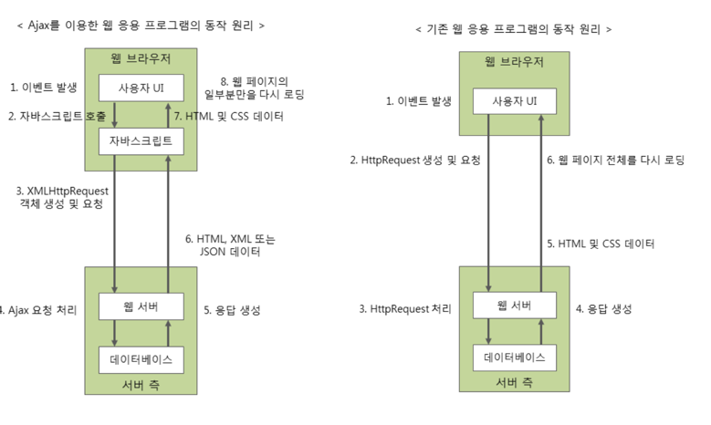

# Ch2. 네트워크 서비스와 어플리케이션 계층 

## 어플리케이션 프로토콜
### 사용자가 직접적으로 사용하는 프로토콜
- HTTP : 웹 클라이언트와 웹 서버 사이에서 웹 페이지 데이터를 주고 받는다.
- POP,SMTP,IMAP : 메일을 송수신하고 보관한다.
- SMB, AFP : LAN 안에서 파일을 공유한다.
- FTP : 서버를 통해 파일을 주고 받는다.
- Telnet, SSH : 원격에서 서버를 제어한다.

### 사용자가 간접적으로 사용하는 프로토콜
- DNS : 도메인명과 IP 어드레스의 정보를 변환할 때 사용한다.
- DHCP : LAN 내의 컴퓨터에게 IP 어드레스를 할당할 때 사용한다.
- SSL/TLS : 통신 데이터를 암호화하여 주요 정보를 안전하게 주고 받을 때 사용한다.

### HTTP 프로토콜
- 요청과 응답 두가지형태로 구분한다.
- 통신과정에서 주고받는 정보를 종합하여 HTTP 메세지라고 한다.
- HTTP 메세지 
  - 요청 정보행(시작줄) : 메서드 + URL + 버전
  - 응답 정보행(시작줄) : 버전 + 상태코드 + 사유구절


### HTTP 해더 
### HTTP 본문

## AJAX
- 자바스크립트를 통해 XMLHttpRequest 객체를 만들어 서버로 요청을 보낸다.
- 요청을 보낸 상태에서 서버의 응답을 기다릴 필요없이 다른 작업 처리 가능 -> 비동기
- 서버에서의 응답을 받고 JS는 일부분만을 갱신하게 한다.



### 웹 서비스(웹 어플리케이션) vs 웹 사이트

#### 웹 사이트란?
- 정보 관람을 목적으로 한 정보를 제공하는 ```정적인``` 사이트
- 위키피디아, 공식문서 페이지 등등
#### 웹 서비스란?
- 동적인 기능을 가진 웹
- 상호작용, 소통을 가능하게 함으로써 저가 능동적으로 웹 어플리케션 상의 서비스를 이용 함
- 사용자의 Input 이 반영 될 수 있음
- 네이버지도, 각종 open API 등등

#### 공통
- 화면이 HTML 데이터로 이루어져 있음


## 쿠키
- 무상태 프로토콜인 HTTP 의 상태 유지를 위해 만들어짐
  - 
- 

## 이메일