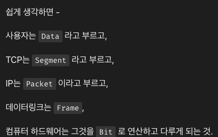
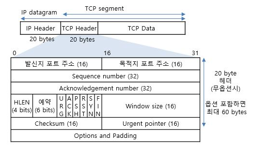
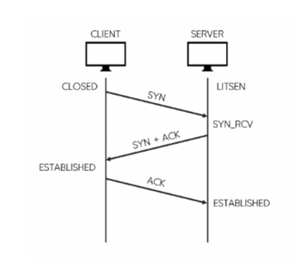
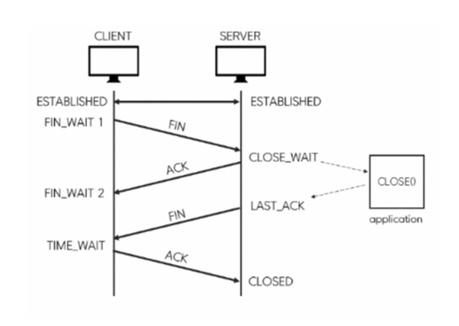

# TCP/IP 쉽게 더 쉽게

## chapter3

## 포트번호
- 트렌스포트 계층에서 포트번호에 따라 구분하여 어플리케이션 계층으로 데이터를 전달
- 패킷은 송진지,수신지 의 어드레스(IP) 와 포트번호를 모두 가지고 있음.
- 한개의 클라이언트로 오는 패킷 또한 클라이언트 포트번호를 통해 식별 되어 짐.
- 클라이언트 보트 번호는 유동적으로 그때 그때 할당 되어짐. (16152~65535번)

- 서버는 수신 대기를 위해 같은 포트 사용, 클라이언트는 서로 다른 IP 어드레스와 각각 요청에 할당된 포트번호를 갖음.
- 접속이 완료 되면 서버는 각 요청의 어드레스와 포트번호를 기억해 누구와 통신하는지를 식별함

## TCP
- 트랜스포트 계층으 프로토콜 중 하나
- 패킷 및 데이터를 세그먼트라고 표현함
- 전송 속도를 조정하고, 누락된 데이터를 재전송하게 됨

### TCP 헤더

- 헤더의 컨트롤 비트를 통해 통신상태를 표현 (FIN,SYC,ACK....)
  - 1 비트 크기를 차지하고 on/off 로 표현함
- 송신지, 수신지 포트번호를 포함
- 일련번호, 확인 응답번호를 포함시켜 데이터가 잘 전달 되었는지와 주고 받는 데이터의 크기를 알 수 있음 

### TCP 의 통신 흐름

- 3핸드 쉐이크 형태로 커넥션 연결을 해냄
  - 통신 시작시 SYN 을 on 으로 설정

